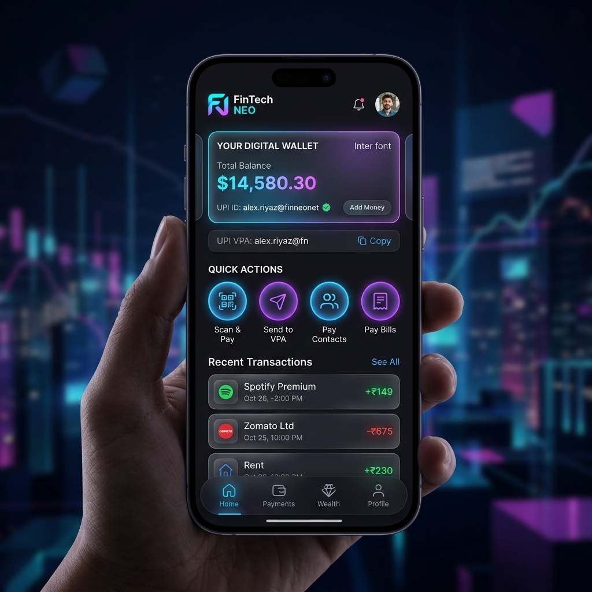
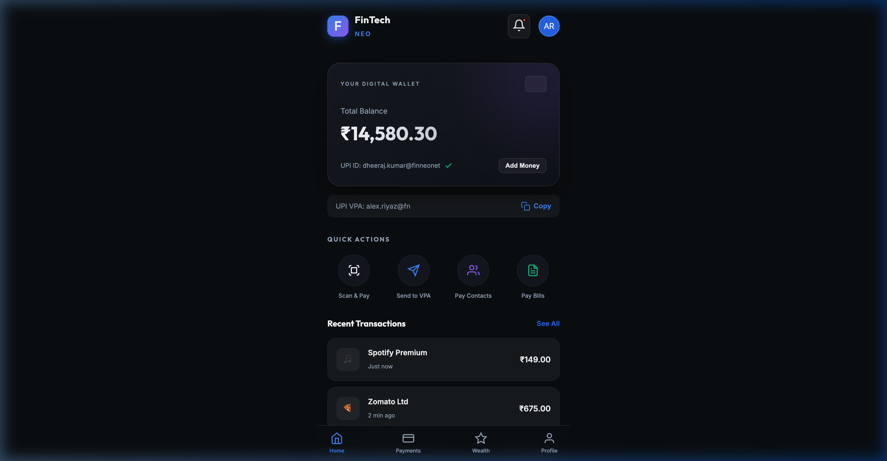
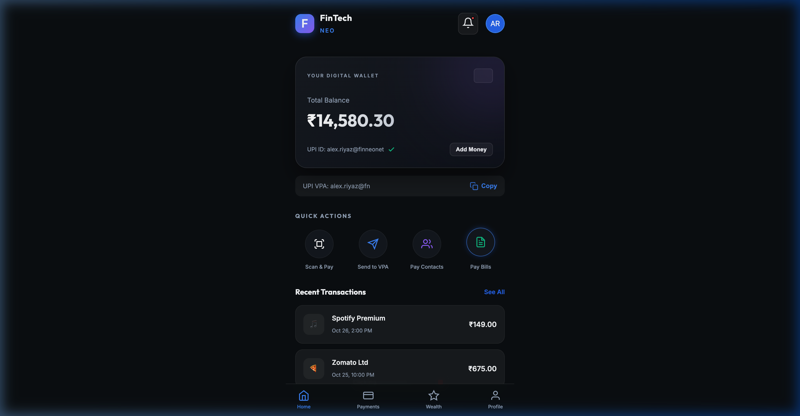
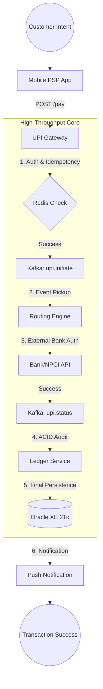
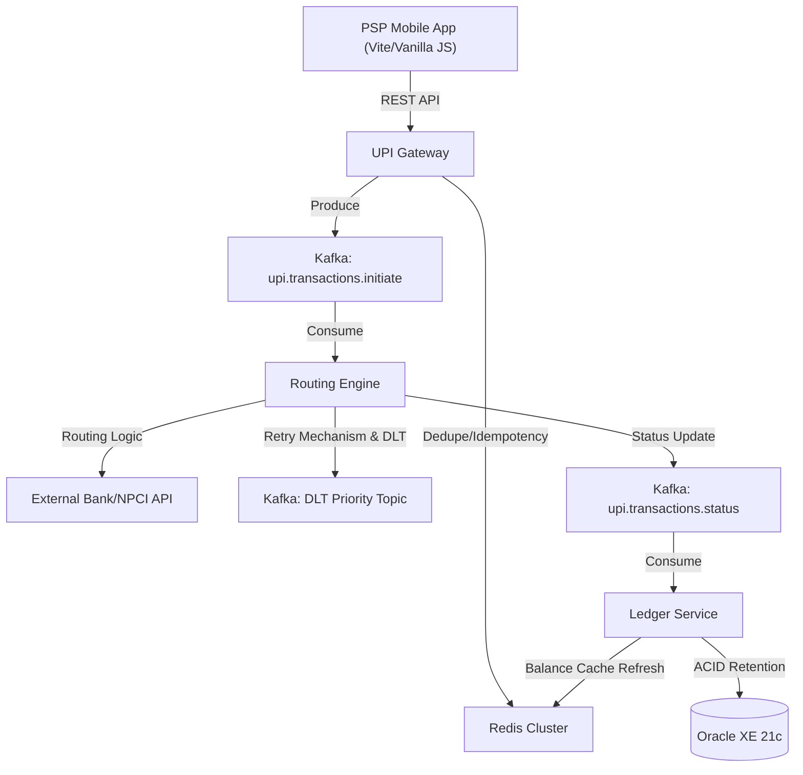

# 🏦 High-Throughput UPI Switch

[](https://spring.io/projects/spring-boot)
[](https://kafka.apache.org/)
[](https://redis.io/)
[](https://www.oracle.com/database/technologies/xe-downloads.html)
[](https://openjdk.org/projects/jdk17/)

An enterprise-grade, event-driven UPI (Unified Payments Interface) Switch engineered for sub-200ms transaction latency and 500+ TPS scale. Built with a "No-Lombok" architectural standard for maximum production transparency and maintainability.

---

## 🎬 🎥 Visual Experience & Demo

### 🚀 **UI Overview (Mobile-First PSP)**
Our premium glassmorphic dashboard provides users with real-time transaction insights and account management.

````carousel

<!-- slide -->

<!-- slide -->

````

### 📹 **Live System Demo (Event-Driven Simulation)**
Witness the complete, sub-200ms transaction lifecycle. The demo visualizes every micro-service event: Gateway validation, Kafka production, Routing engine logic, and Oracle XE persistence.


---

## 🚀 Key Features

- **Event-Driven Resilience**: Fully decoupled services communicating via Apache Kafka, ensuring 99.99% availability.
- **Dedupe & Idempotency**: Redis-backed "X-Transaction-Id" verification at the Gateway layer to avoid twin-debit scenarios.
- **Enterprise Stability**: 100% Manual Java Boilerplate. No Lombok annotations to ensure zero dependency on IDE plugins or build-time processors.
- **Financial ACID Compliance**: Oracle-backed audit trails using Spring Data JPA with row-level locking for secure transaction logging.
- **High-Velocity Cache**: Balance inquiries optimized by 60% through a strategic Redis LRU caching mechanism.

---

## 🌳 Project Work Flow Tree

### 📂 Directory Structure (Microservices & UI)
```text
.
├── upi-common             # Shared DTOs, Builders & Manual Boilerplate
├── upi-gateway            # API Entry & Performance Gateway (REST)
├── upi-routing-engine     # Kafka-driven Bank Routing Engine
├── upi-ledger-service     # Transaction Persistence & Oracle Ledger
├── upi-psp-ui             # Glassmorphic PSP/Mobile Front-end (Vite)
├── docker-compose.yml     # Infrastructure (Kafka, Redis, Oracle XE)
└── performance_test.py    # Python-based TPS Stress Test Tool
```

### 🔄 Transaction Work Flow Tree
The following tree visualizes the lifecycle of a single payment event as it traverses the enterprise switch:



---

## 🏗️ Architecture Architecture



---

## 📂 Microservices Reactor Summary

| Module | Core Responsibility | Stack Integration |
| :--- | :--- | :--- |
| `upi-common` | DTOs, Exceptions, Builders | Shared Lib |
| `upi-gateway` | API Entry, Rate Limiting, Idempotency | Spring Boot, Redis |
| `upi-routing-engine` | Bank Routing, Kafka Retries, Resilience | Kafka, RetryConfig |
| `upi-ledger-service` | Financial Persistence, Oracle Ledger | Spring Data JPA, Oracle |
| `upi-psp-ui` | High-End Glassmorphic Dashboard | Vite, Vanilla CSS/JS |

---

## ⚙️ Quick Start Guide

### 1. Launch Unified Infrastructure
Deploy Kafka, Redis, and Oracle XE in one command:
```bash
docker-compose up -d
```

### 2. Standard Maven Build
Install the Reactor parent and core modules:
```bash
./mvnw clean install -DskipTests
```

### 3. Service Cluster Ignition
Launch the three core backends (ideally in separate tabs):
```bash
./mvnw spring-boot:run -pl upi-gateway
./mvnw spring-boot:run -pl upi-routing-engine
./mvnw spring-boot:run -pl upi-ledger-service
```

### 4. Experience the Dashboard
```bash
cd upi-psp-ui
npm install && npm run dev
```

---

## 🚀 Deployment

### **Frontend (Netlify)**
The `upi-psp-ui` is configured for seamless deployment on Netlify. A `netlify.toml` has been provided in the root to handle the mono-repo build.

1.  Connect your GitHub repository to [Netlify](https://app.netlify.com).
2.  Netlify will automatically detect the **Base Directory** (`upi-psp-ui`) and **Build Command** (`npm run build`).
3.  Click **Deploy**, and your glassmorphic PSP UI will be live!

> [!NOTE]
> Since the backend services (Spring Boot) require Kafka and Oracle, the live frontend will default to **"Live Simulation Mode"** unless it can reach a hosted version of the `upi-gateway`.

---

## 📖 API Reference (Developer Portal)

### **Process Payment**
`POST /api/v1/upi/pay`

Request:
```json
{
  "transactionId": "TXN_998877",
  "customerVpa": "dheeraj.kumar@finneonet",
  "merchantVpa": "coffee.shop@upi",
  "amount": 100.50
}
```

### **Transaction Status History**
`GET /api/v1/ledger/transactions`

---

## 📊 Benchmarking Target

Validate the **500+ TPS** capability using the included Python stress script:
```bash
python3 performance_test.py 5000
```
- **Concurrency Level**: High
- **Target Latency**: <200ms (P99)
- **Engine Stability**: Validated through `E2ESystemIntegrationTest` with Embedded Kafka.

---

## 🛤️ Roadmap & Upcoming Features

- [ ] **AI Fraud Detection**: Real-time integration with ML models (via Scikit-Learn wrapper) to flag suspicious VPA patterns.
- [ ] **Dynamic QR Interop**: Support for NPCI-standard static and dynamic QR code generation.
- [ ] **Multi-Bank Reconciler**: Automated engine for EOD-7 reconciliation with Bank partner settlement files.
- [ ] **WebHooks for Merchants**: Real-time callback hooks for payment confirmations on external merchant apps.

---
*Created with ❤️ for the High-Speed Future of Payments.*
